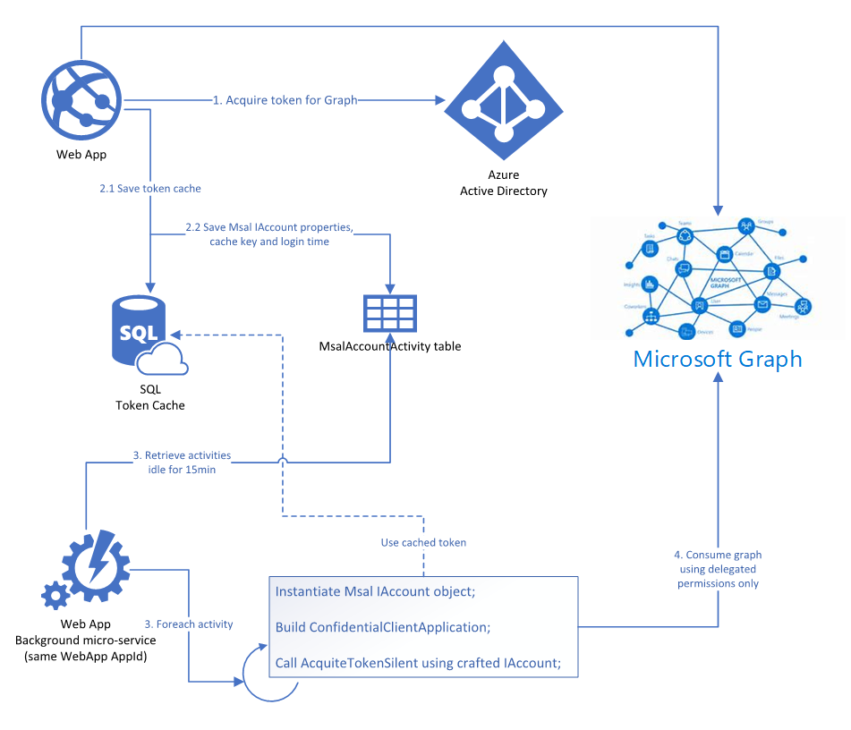

# Background process using MSAL cache from a web app

This sample shows a concept of how to reuse MSAL external token cache (from a web app) on a daemon application. 

With this approach, the daemon app can acquire an access token silently and consume Microsoft Graph for example, using only delegate permissions.

# Diagram



## Required configuration

This sample is using SQL token cache leveraging the library **Microsoft.Extensions.Caching.Distributed**, so to create the necessary table, run the following command on the Package Manager Console, updating the connection string accordingly to your development environment:

```c#
dotnet tool install --global dotnet-sql-cache
dotnet sql-cache create "Data Source=(localdb)\MSSQLLocalDB;Initial Catalog=MY_TOKEN_CACHE_DATABASE;Integrated Security=True;" dbo TokenCache
```

Then open a Command Prompt, navigate to the *WebApp* folder and run the Entity Framework migration scripts:

```ph
cd C:\<PathToTheProject>\BackgroundCacheRenew\WebApp
dotnet ef database update
```

Lastely, update the `appsettings.json` from the *WebApp* and *DeamonApp* with the values of your application registered in Azure AD. Also update the `TokenCacheDbConnStr` with your own connection string.

Note that **both apps must share the same clientId** for this sample to work.
